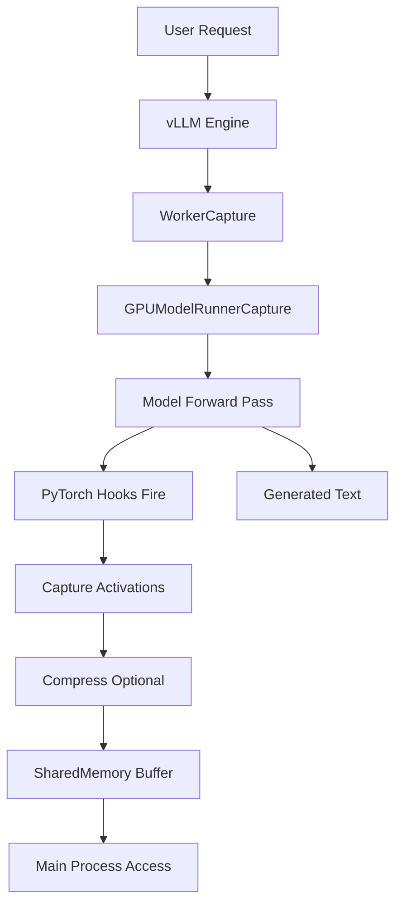

# vLLM Modifications Documentation

## Overview

This document details the modifications made to vLLM v0.10.1 to enable real-time activation capture during inference.

## Key Innovation

**Single-Pass Capture**: Hooks fire during the EXACT forward pass that generates text - no double computation, no hoping for identical results.

## Modified Files

### 1. `gpu_model_runner_capture.py`

**Location**: `vllm_capture/gpu_model_runner_capture.py`  
**Original**: `vllm/v1/worker/gpu_model_runner.py`

#### Key Changes:

```python
class GPUModelRunnerCapture(GPUModelRunner):
    """Extended model runner with activation capture via PyTorch hooks."""
    
    def __init__(self, vllm_config, device, capture_config=None):
        super().__init__(vllm_config, device)
        self.capture_config = capture_config or ActivationCaptureConfig()
        self.activation_buffer = SharedActivationBuffer(...)
        self.captured_activations = {}
```

#### Hook Registration:

```python
def _register_hooks(self):
    """Register forward hooks on specified layers."""
    for layer_idx in self.layers_to_capture:
        layer = self.model.model.layers[layer_idx]
        handle = layer.register_forward_hook(
            self._create_hook(layer_idx)
        )
        self.hook_handles.append(handle)
```

#### Hook Function:

```python
def _create_hook(self, layer_idx):
    def hook(module, input, output):
        # Capture during ACTUAL forward pass
        if self.capture_config.enabled:
            # Extract last token (most relevant for generation)
            activation = output[0][:, -1, :].detach()
            
            # Optional compression
            if self.capture_config.compression_k:
                activation = self._compress_activation(activation)
            
            # Store for transfer
            self.captured_activations[f"layer_{layer_idx}"] = activation
    return hook
```

### 2. `gpu_worker_capture.py`

**Location**: `vllm_capture/gpu_worker_capture.py`  
**Original**: `vllm/v1/worker/gpu_worker.py`

#### Key Changes:

```python
class WorkerCapture(Worker):
    """Modified worker using capture-enabled model runner."""
    
    def init_device(self):
        super().init_device()  # Sets up self.device
        
        # Replace model runner with capture version
        if self.capture_config.enabled:
            self.model_runner = GPUModelRunnerCapture(
                self.vllm_config,
                self.device,
                capture_config=self.capture_config
            )
```

### 3. `SharedActivationBuffer`

**New Component**: Manages zero-copy tensor transfer via shared memory.

```python
class SharedActivationBuffer:
    """Zero-copy shared memory buffer for activation transfer."""
    
    def __init__(self, name, size_gb, mode='write'):
        self.shm = shared_memory.SharedMemory(
            create=(mode=='write'),
            size=int(size_gb * 1024**3),
            name=name
        )
        self.buffer = np.ndarray(
            (self.size_bytes,),
            dtype=np.uint8,
            buffer=self.shm.buf
        )
```

## Architecture Flow



## Configuration System

### Environment Variables

```python
# In GPUModelRunnerCapture.__init__
self.capture_config = ActivationCaptureConfig(
    enabled=os.environ.get("VLLM_CAPTURE_ENABLED", "0") == "1",
    layers=self._parse_layers(os.environ.get("VLLM_CAPTURE_LAYERS")),
    compression_k=int(os.environ.get("VLLM_CAPTURE_COMPRESSION_K", 0)),
    buffer_size_gb=float(os.environ.get("VLLM_CAPTURE_BUFFER_SIZE_GB", 2.0)),
    sample_rate=float(os.environ.get("VLLM_CAPTURE_SAMPLE_RATE", 1.0)),
)
```

## Key Technical Decisions

### 1. Why Hooks Instead of Modifying Forward Pass?

- **Non-invasive**: Doesn't change model computation
- **Flexible**: Can be enabled/disabled dynamically
- **Compatible**: Works with any transformer model

### 2. Why Shared Memory?

- **Zero-copy**: Avoids serialization overhead
- **Fast**: Direct memory access between processes
- **Scalable**: Fixed memory footprint

### 3. Why Last Token Only?

- **Relevance**: Last token is being generated
- **Efficiency**: Reduces storage by seq_len factor
- **Sufficient**: Contains decision information

### 4. Why Optional Compression?

- **Flexibility**: Choose fidelity vs storage
- **SVD**: Preserves most information
- **GPU-accelerated**: Compression happens on GPU

## Performance Optimizations

1. **Selective Capture**: Only specified layers
2. **Sampling Rate**: Can capture subset of inferences
3. **Buffer Reuse**: Fixed-size rolling buffer
4. **Async Transfer**: Background thread for analysis
5. **Post-hoc Marking**: Only save interesting events

## Compatibility

- **vLLM Version**: v0.10.1+
- **Models**: Any transformer model (tested with Qwen, Llama)
- **Hardware**: NVIDIA GPUs (tested on H100, A100)
- **Python**: 3.10+

## Integration Points

### Using with Standard vLLM

```python
from vllm import LLM

# Simply specify custom worker class
llm = LLM(
    model="any-transformer-model",
    worker_cls="vllm_capture.WorkerCapture",  # Our modification
    enforce_eager=True,  # Required for hooks
)
```

### Accessing Captured Activations

```python
from vllm_capture import ActivationReader

# Connect to shared memory buffer
reader = ActivationReader(rank=0)

# Get activations after generation
activations = reader.get_latest_activations()
```

## Validation

The modifications have been validated to:
1. Produce identical text outputs as standard vLLM
2. Capture activations during exact inference
3. Handle multi-GPU setups (tensor parallel)
4. Scale to 70B+ parameter models

## Future Enhancements

1. **Attention Weights**: Capture attention patterns
2. **Gradient Information**: For attribution analysis
3. **Streaming Capture**: Real-time activation streaming
4. **Distributed Capture**: Multi-node activation gathering

---

**Note**: These modifications maintain full compatibility with vLLM's architecture while adding powerful interpretability capabilities.